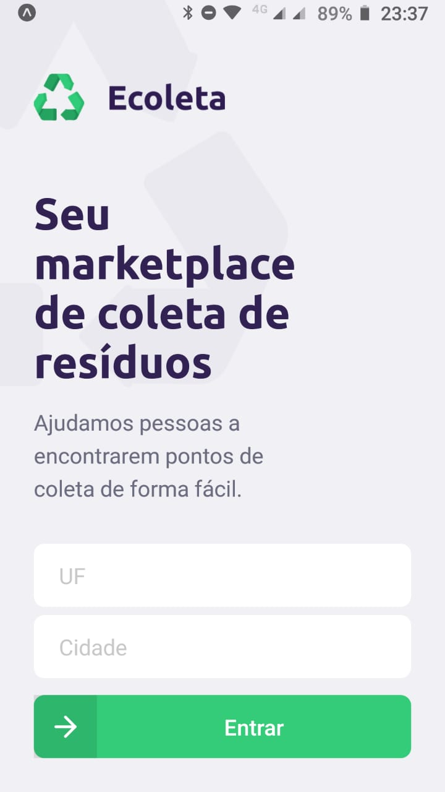
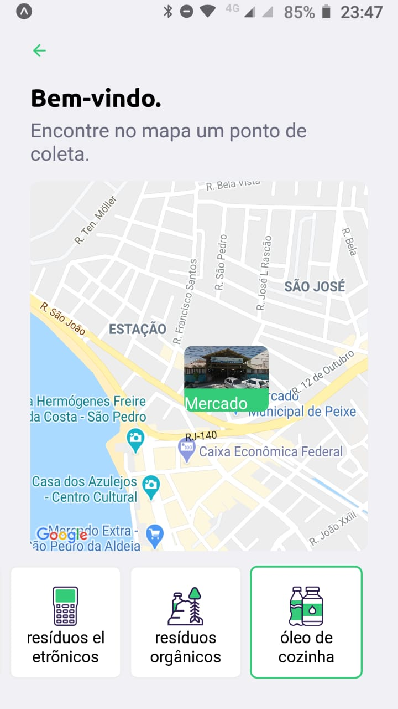
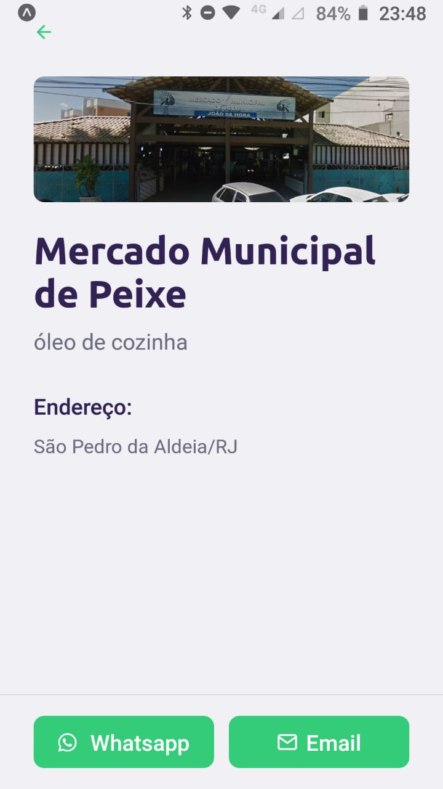

# nlw

## Next Level Week linking repository

- [Front-end (web app)](https://github.com/AndreLuiz-JS/nlw-web)

- [Mobile](https://github.com/AndreLuiz-JS/nlw-mobo)

- [Backend](https://github.com/AndreLuiz-JS/nlw-backend)

# ScreenShots

  ## Web
  

  
  
  
  

  ## Mobile
  

  
  
  
  

